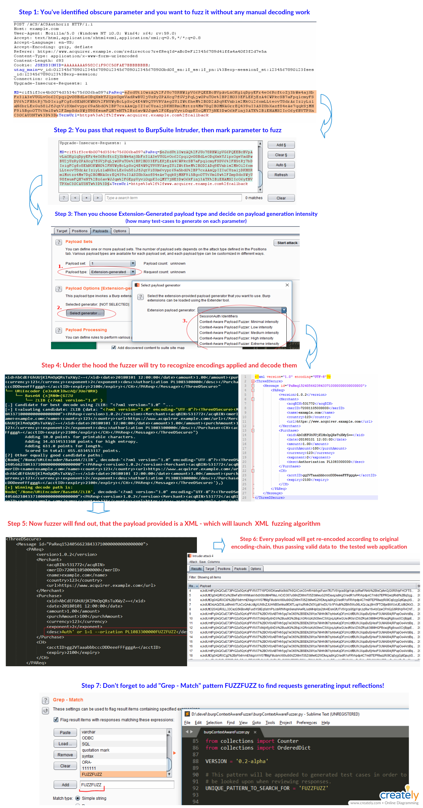

## burpContextAwareFuzzer (WORK IN PROGRESS)

BurpSuite's payload-generation extension aiming at applying fuzzed test-cases depending on the type of payload (basic like integer, string, path; JSON; XML; GWT; binary) and following encoding-scheme applied.

The project is just starting, so there are might be many issues, glitches and areas to improve.

## How does it work?




*Oh, by the way - this is how XML Fuzzing could look like:*


## Features

This extension is an answer to a generic problem while using BurpSuite's _Intruder_ tool: 
_what kind of payload am I dealing with, how it has been encoded, what test-cases to generate upon it and re-encode it to proper form?_

Before having that, a penetration tester would have to script his own proxy script (and/or extension) to cover appp various encodings that were not supported by BurpSuite (like ZLIB).

Now, in order to accomplish the same task, one can use that extension, which implements following features:

### Payload type detection

The extension has to detect with what kind of payload is it dealing with at the moment:
- Basic type, like: Integer, Float, Path, String
- JSON
= XML
- GWT (_to be implemented_)
- unknown binary data (_to be implemented_)
- Some serialized stream (_to be implemented_)

Having detected type of the payload, the extension will leverage that information to generate proper (according to the context) edge-case values, like integer overflows, path-traversal mutations and so on. Also, having JSON or XML object - it will iterate over it recursively, generaring along the way fuzz values for every parameter or attribute met. 

**This makes the extension a powerful companion while dealing with severly encoded JSON/XML payloads**, making it possible to fuzz them without a hassle.

### Encoding detection and re-encoding

There are many situations in which the application is using some kind of encoding to pass around it's parameters. Among the others, the application may use:

- Base64 and Bas64 URL safe
- Hex encoding
- URL Encoding
- JWT
- ZLIB
- combination of them

For instance, there might be payload like: `SGVsbG9Xb3JsZA%3d%3d` that is a result of `URLEncode(Base64('HelloWorld'))`. In order to get to the inner string, the fuzzer would have to peel of those encodings - mutate the value, and re-apply encodings in reversed order.

For this purpose, the extension will use following [gist](https://gist.github.com/mgeeky/1052681318a8164b112edfcdcb30798f).


## Installation and Usage

### Installation
In order to install that extension - download the `*.py` file, then in _Extender->Extension_ select _Add_. Then specify that extension is of type _Python_ (you will have to install [_Jython_](http://www.jython.org/downloads.html) first ).

Then, in your command line - install Jython requistities:

On windows:
```
cmd> java -cp jython.jar org.python.util.jython -m ensurepip
cmd> java -cp jython.jar org.python.util.jython -m ensurepip --upgrade
cmd> java -cp jython.jar org.python.util.jython
Jython 2.7.1b3 (default:df42d5d6be04, Feb 3 2016, 03:22:46)
[Java HotSpot(TM) 64-Bit Server VM (Oracle Corporation)] on  java1.8.0_144
Type "help", "copyright", "credits" or "license" for more information.
>>> try:
...     from pip import main as pipmain
... except:
...     from pip._internal import main as pipmain
...
>>> pipmain(['install', '--upgrade', 'pip'])
>>> pipmain(['install', 'anytree'])
>>> pipmain(['install', 'pyjwt'])
```

On linux:
```
Try the same as for Windows.
```
(in case _pip_ fails: try looking for packages like _python2-pyjwt_ ).


### Usage

This is a Payload Generation, so it comes into play in _Intruder_->_Payloads_->_Payload Type_->_Extension-generated_->_Selected generator_->**_Context-Aware Fuzzer_** . Having it specified as your payload-generator, you can start the attack and watch the payloads being mutated.

There are 5 different level of fuzzing intensity implemented, each of them differs in number of test-cases to use per one parameter. Figures are following:
- Minimal: +/- 50 requests/parameter
- Low: +/- 100-130 r/p
- Medium: +/- 150-240 r/p
- High: +/- 180-440 r/p
- Extreme: +/- 260-750 r/p

Those figures scale up when the fuzzer is being given with for instance JSON or XML object, having N attributes and nodes.


### KNOWN BUGS / LIMITATIONS:
1) At the moment XML payloads fuzzing has been disabled since there is a problem with Jython's ElementTree implementation, that is implemented in Xerces SAXParser. Refer to:
[sax2-driver-class-org-apache-xercer-parses-saxparser-not-found](https://support.portswigger.net/customer/portal/questions/16996471-sax2-driver-class-org-apache-xercer-parses-saxparser-not-found)

If you think the problem is solved, refer to 'ContextAwareFuzzer.__init__()' and uncomment 'XMLTypeFuzzer' in 'self.typeHandlers'.

2) Hardcoded fuzz entries list are to be further optimized and tested since they are crucial to number of input test-cases to generate, and thus directly affect fuzzer's performance.

3) The fuzzer itself could benefit from more intelligent test-cases generation patterns that have been implemented so far (mostly very generic and simple ones, like bit flipping or cutting parameters in half).

